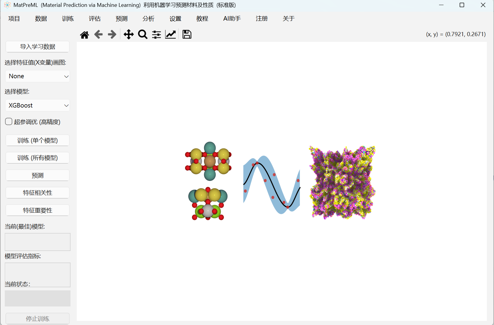
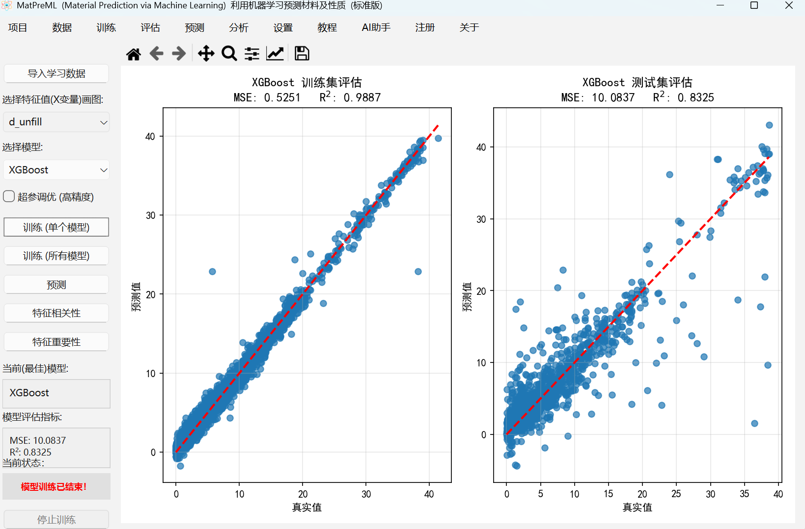

# MatPreML — Materials Prediction via Machine Learning

MatPreML is a desktop application that leverages machine learning algorithms to predict material properties, helping materials science researchers rapidly evaluate material performance and accelerate the discovery of novel functional materials.




## Features

- **Multiple ML Models**: Linear Regression, Decision Tree, Random Forest, SVR, Gradient Boosting, Lasso, Bayesian Ridge, and Neural Network
- **Data Import & Processing**: Load CSV datasets with automatic feature detection and visualization
- **Model Training & Optimization**: Train individual or all models with one click; optional Bayesian hyperparameter optimization
- **Visualization**: Rich plotting of prediction results, model performance comparison, and data exploration
- **Feature Engineering**: Correlation analysis and feature importance evaluation
- **Model Persistence**: Save trained models to file and reload them for later prediction
- **AI Assistant Integration**: Built-in DeepSeek API integration for intelligent data analysis
- **Chemical Formula Analysis**: Automatic extraction and encoding of elemental features from chemical formulas

## Screenshots

| Main Interface | Model Training |
|:---:|:---:|
|  |  |

## Requirements

- **OS**: Windows 7/8/10/11
- **RAM**: 4 GB minimum (8 GB+ recommended)
- **Disk**: 500 MB free space
- **Python**: 3.8+

## Quick Start

1. **Clone or download** the repository
2. **Install dependencies**:
   ```bash
   pip install -r requirements.txt
   ```
3. **Launch the application**:
   ```bash
   python start.py
   ```
   Or double-click `start.cmd` on Windows.

## Usage Guide

### 1. Create a New Project
   - Click **File → New Project**, enter a project name, and choose a save location.

### 2. Import Training Data
   - Click **Import Training Data** and select a CSV file. The data will be loaded and displayed automatically.

### 3. Select a Model
   - Choose a machine learning model from the dropdown menu.
   - (Optional) Check **Hyperparameter Tuning** to enable Bayesian optimization.

### 4. Train the Model
   - Click **Train (Single Model)** or **Train (All Models)** to start training.
   - View evaluation metrics and prediction plots after training completes.

### 5. Make Predictions
   - With a trained model, click **Predict**, select your prediction data CSV, and view the results.

### 6. Analyze Features
   - Use **Feature Correlation** to explore relationships between variables.
   - Use **Feature Importance** to identify the most influential features.

## Project Structure

```
MatPreML/
├── configure/           # Configuration files
│   ├── readme.txt       # Chinese user manual
│   ├── models.txt       # Model descriptions
│   └── tutorial.txt     # Tutorial content
├── data/                # Sample data directory
├── MatPreML_refactored/ # Main application package
│   ├── config.py        # Global configuration and constants
│   ├── main.py          # Application entry point
│   ├── models.py        # ML model wrappers
│   ├── threads.py       # Thread pool for training tasks
│   ├── chemical.py      # Chemical formula parser
│   ├── data_analyzer.py # Data analysis utilities
│   ├── license_core/    # Registration verification (compiled)
│   ├── mixins/          # UI, data, training, analysis modules
│   └── bayesian_opt/    # Bayesian optimization engine
├── start.py             # Application launcher
├── start.cmd            # Windows batch launcher
├── demo-1.png           # Screenshot 1
└── demo-2.png           # Screenshot 2
```

## License

This software is developed by the **Functional Materials Research Division, Institute of Solid State Physics, Chinese Academy of Sciences**. It is free for academic research use. Commercial use requires permission.

## Contact

- **Author**: Lu Wenjian (鲁文建)
- **Email**: wjlu@issp.ac.cn
- **Version**: V2.4
- **Affiliation**: Functional Materials Research Division, Institute of Solid State Physics, Chinese Academy of Sciences
